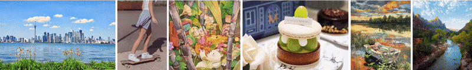

<h2 align="center">Neural Preset: Faithful 4K Color Style Transfer in Real Time</h2>

<div align="center"><i>Neural Preset for Color Style Transfer (CVPR 2023)</i></div>

<br>



<div align="center">Retouch Photos & Videos with AI-Generated Color Presets</div>

<br>

<p align="center">
  <a href="">Paper</a> |
  <a href="https://zhkkke.github.io/NeuralPreset">Project Page</a> |
  <a href="https://youtu.be/GgLKCrVv3yA">Supplemental Video</a>
</p>

<p align="center">
  <a href="#image-stylization-demo">Image Stylization Demo</a> |
  <a href="#video-stylization-demo">Video Stylization Demo</a> |
  <a href="https://apps.apple.com/us/app/tinge-creative-photo-filters/id6445956281">iOS App</a>
</p>

<p align="center">
  <a href="#license">License</a> |
  <a href="#citation">Citation</a> |
  <a href="#contact">Contact</a>
</p>


---


## News
Please refer to our [Project Page](https://zhkkke.github.io/NeuralPreset) for details. More resources will be released.


## Image Stylization Demo
Please use our [Online Demo](https://zhkkke.github.io/NeuralPreset/#/editor) or [iOS App](https://apps.apple.com/us/app/tinge-creative-photo-filters/id6445956281) for image color style transfer.


## Video Stylization Demo
Coming Soon. Stay tuned.


## License
This project is released under the [Creative Commons Attribution NonCommercial ShareAlike 4.0](https://creativecommons.org/licenses/by-nc-sa/4.0/legalcode) license.


## Citation
If this work helps your research, please consider to cite:

```bibtex
@InProceedings{NeuralPreset,
  author = {Zhanghan Ke and Yuhao Liu and Lei Zhu and Nanxuan Zhao and Rynson W.H. Lau},
  title = {Neural Preset for Color Style Transfer},
  booktitle = {Computer Vision and Pattern Recognition Conference (CVPR)},
  year = {2023},
}
```


## Contact
This repository is maintained by Zhanghan Ke ([@ZHKKKe](https://github.com/ZHKKKe)).  
For questions, please contact `kezhanghan@outlook.com`.
